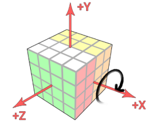

# Rubiks-Cube-Robot

A Rubik's Cube _(actually [Rubik's Revenge](https://en.wikipedia.org/wiki/Rubik%27s_Revenge))_ robot,
does nothing but solves a `4x4x4 Rubik's Cube`. 

:hammer: Crafted with [LEGO Mindstorms](https://www.lego.com/en-us/mindstorms/products/mindstorms-ev3-31313).

For the OpenCV part, see [wenoptics/Rubiks-Revenge-OpenCV](https://github.com/wenoptics/Rubiks-Revenge-OpenCV)

## What

The project was completed using parts from LEGO Mindstorms NXT. It's limited to used only 3 motors (actuators)
and complete the task of solving a 4x4x4 Rubik's Cube (aka Rubik's Revenge) from any valid state.

## TL;DR (Show me videos!)

<p align="center">
<a href="http://www.youtube.com/watch?feature=player_embedded&v=qqWS-qgw8oM
" target="_blank"></a>
<br>YouTube
</p>

<p align="center">
<a href="http://www.youtube.com/watch?feature=player_embedded&v=JE0w4DwlktM
" target="_blank"></a>
<br>YouTube
</p>

<p align="center">
<a href="http://www.youtube.com/watch?feature=player_embedded&v=JnoVRYcmtBo
" target="_blank"></a>
<br>YouTube
</p>

## Design

Goal: Design combination of mechanisms to accomplish any valid operation in a Rubik's Revenge.

### The nature of a Rubik's Revenge

Any valid operation is composed of rotations of certain layer of the cube. I will call these rotation operations 
atomic operations, which essentially means these are the minimal operations dividable. 

<p align="center">

<br>(cube layer operation)
</p>

All methods of rotation of the Rubik's Cube, including a Rubik's Cube solution in an out-of-order state, are collections 
of atomic operations.

The cube fourth-order cube can create a coordinate system of three orthogonal axes in space, then the atomic operation 
can also be expressed as a rotation operation on a layer on one of the three axes.
For this project, I will use the Cartesian right-handed coordinate system.

<p align="center">

<br>(Cartesian right-handed coordinate system)
</p>

### Movement Design

Since only three actuators is the limitation of the project, the whole design will be in such premise.
"`layer selection`" action, the "`layer turn`" action, and the Rubik's cube `X-axis flip` action is the 3 actions required. 
The combined use of the three actions will enable the machine to perform any valid operation on the Cube.

Below shows the idea of my design process:

#### 

1) Design a single axial layer operating mechanism (named `A`) so that the cube layer in one axial direction can perform 
a rotating operation.

In practice, I make this axis the `y` axis. The figure shows the layer rotation on Y-axis.

<p align="center">

<br>(cube layer operation)
</p>


2) Design the "`layer selection`" mechanism (B) so that the Cube and the layer rotation mechanism (A) can move relative to 
each other, and is able to rotate the n layers of the shaft (Y axis) up to the top face.

<p align="center">

<br>(The cube moves upward relative to the layer-turning mechanism, and the top layers can be rotated together)
</p>


Specifically, I denote rotating +90° as `lRt(n)`; the rotation -90° is denoted as `\bar{lRt}(n)`.

So far, all layer atom operations in the direction of one axis (i.e. the Y axis) have developed.


3) Design the Cube X-axis turning mechanism (`C`) so that the Cube can be flipped around its X axis. Denoted the symbol 
of flipping the cube around the X axis by +90° as `cRt(x)`.

<p align="center">

<br>(the flip operation on X axis)
</p>


In particular, layer rotation of the layer `n=4` is equivalent to rotation of the cube around the Y axis, i.e.

`lRt\left(4\right)=cRt(y)`

Therefore, the combination of the layer transition and the layer selection mechanism (`A` and `B`) can achieve the 
rotation of the cube around the Y axis.

In addition,

`cRt\left(z\right)=cRt\left(y\right)+\bar{cRt}\left(x\right)+\bar{cRt}(y)`

That is, the combination of the motion of the Cube around the X axis and the rotation around the Y axis 
can cause the cube to rotate about the Z axis.

At this point, all the axes of the Rubik's cube have been flipped.

With the flip operation on X axis, I can flip any layer on the axial axis to the Y-axis and cooperate with the Y-axis 
layer-turning mechanism (ie, the combination of `A` and `B`) to achieve the rotation of all layers of the cube.

### Overall Robot Design

Since there is no color recognition module existed in LEGO Mindstorms NXT, the solution ends with image capture using a 
USB camera and run color recognition with OpenCV. To make it simple, I decide to collect the image with a camera and 
processed on a PC, and the color recognition result will be transmitted to the NXT controller via Bluetooth, 
the electromechanical driver and solver algorithms will be run on the NXT controller. 

The block diagram of the robot is shown below.


## Control Algorithm


This part describes the ideas and the electromechanical control algorithm on the NXT. The complete code is on 
github. The LEGO NXT controller uses the `RobotC 3.07` OS.

### 1. An abstract method for controlling motor rotation angle with encoder in RobotC

as in `electricBase.c`

```c
void setAngleRelative(int motorName, int relativeAngle, int moveSpeed)
{
    moveSpeed = abs(moveSpeed);
    //clear the LEGO motor encoders
    nMotorEncoder[motorName] = 0;  
    //set the target stoping position
    nMotorEncoderTarget[motorName] = relativeAngle; 
    if (relativeAngle < 0) {
        moveSpeed = -moveSpeed;
    }

    //turn both motors on at 30 percent power
    motor[motorName] = moveSpeed; 

    //while the encoder wheel turns one revolution
    while (nMotorRunState[motorName] != runStateIdle) 
    {
        wait1Msec(msForMultiTasking);
    }

    motor[motorName] = 0;
}
```

### 2. The alignment feedback component of the layer rotation mechanism

At the very end of the layer-turning mechanism, that is, the layer-turning mechanism is actually mounted with a 
reflective photoelectric sensor in the vicinity of the beam to which the cube is applied. And a baffle that enhances 
reflection is installed around the rotating cage at a position spaced 90 degrees apart. When the layer is turned, 
a closed-loop control part with a coarse adjustment of the encoder motor and a fine adjustment of the feedback 
photoelectric sensor will be formed. The reflective baffle has a suitably small area, and the appropriate photoelectric 
reading is used as a threshold. When the rotating cage finally stops within the threshold range, it is the end of 
the rotation allowed to the error. I name this process `center-position-finding`.

After analyses and trials, a recursive idea of ​​the alignment algorithm was finally adopted. The flow chart below 
illustrates the idea of ​​this algorithm. The implementation code snippet is also given later.


As in `action.c`:

```c
void LSFindPosition_currentAsCentre(int startDirection, int maxFindAngle, int speed, int lowRequirement=0) {

    const int minSearchSpeed = 15;
    int direction = startDirection>0 ? 1 : -1;
    LS_DirectionBeforeAligned = 0;
    speed = abs(speed);
    int _maxAngle, maxAngle = abs(maxFindAngle);
    bool isFoundPosition = false;
    int maxLastTurnMax;
    int nowVal;

    if (startDirection == 0 ) return;
    if (speed <= minSearchSpeed) {
        // still cannot find it. dont speed too much time on this.
        writeDebugStreamLine("still cannot find it, exit");
        return;
    }

    int _turn = 0;
    while ( 1 ) {
        _turn ++;
        maxLastTurnMax = -1;

        // reset the encoderVal to 0
        nMotorEncoder[motorLS] = 0;
        // the first turn, we make the turn half of the maxFindAngle.
        if (_turn==1) {
            _maxAngle = maxAngle / 2;
        }else if (_turn==2){
            _maxAngle = maxAngle;
        }else{
            // the larger the turn, the wider we rotate to find
            _maxAngle = (float)(1.3 * _maxAngle);
        }

        if (_turn>=9) {
            writeDebugStreamLine("we speed too much turn, exit");
            motor[motorLS] = 0;
            break;
        }
        motor[motorLS] = direction * speed;
        #define nowVal SensorValue[sensorLightLSRotate]
        while ( nowVal < LSRotateLightThreshold ) {
            // we stop at position where produced the max value, ...or
            //     just stop at the minCandidate value.
            if ( nowVal > LSRotateLightCandidateThreshold && nowVal > lowRequirement ) {
                motor[motorLS] = 0;
                wait1Msec(200);
                // the deeper we located, the narrower we rotate to find
                maxFindAngle = (float)(0.8*maxFindAngle);

                LSFindPosition_currentAsCentre(direction, maxFindAngle, speed, nowVal);
                return;
            }

            if(nowVal > maxLastTurnMax)
                maxLastTurnMax = nowVal;

            wait1Msec(msForMultiTasking);

            if (abs(nMotorEncoder[motorLS]) > _maxAngle) {
                // rotate too much? Then we jump out.
                break;
            }

        }
        motor[motorLS] = 0;

        wait1Msec(200);
        if (SensorValue[sensorLightLSRotate] < LSRotateLightThreshold) {
            // I think the rotation is just too much... rotate back
            direction *= -1;

        }else{
            // we found the position!
            writeDebugStreamLine("found it!exit");
            LS_DirectionBeforeAligned = direction;
            break;
        }

        // gradually decrease the speed.
        speed = speed <= minSearchSpeed ? minSearchSpeed : speed-5;
    }
}

```

<p align="center">

<br>(Layer turning alignment sensor reading sampling (the picture shows 3 alignment processes))
</p>

## Image Recognition using OpenCV

see [wenoptics/Rubiks-Revenge-OpenCV](https://github.com/wenoptics/Rubiks-Revenge-OpenCV)
